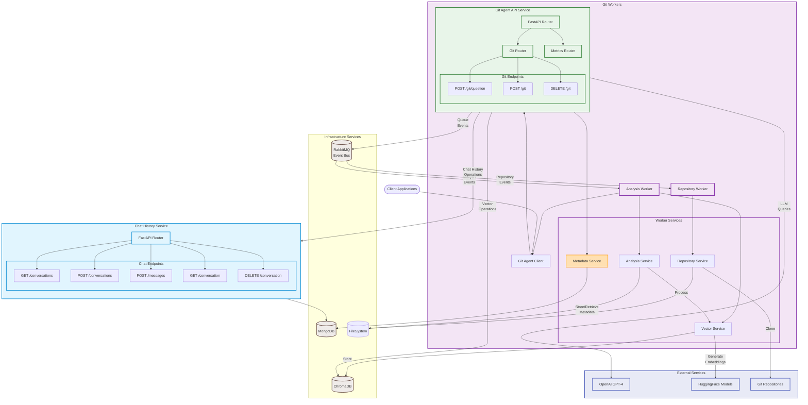
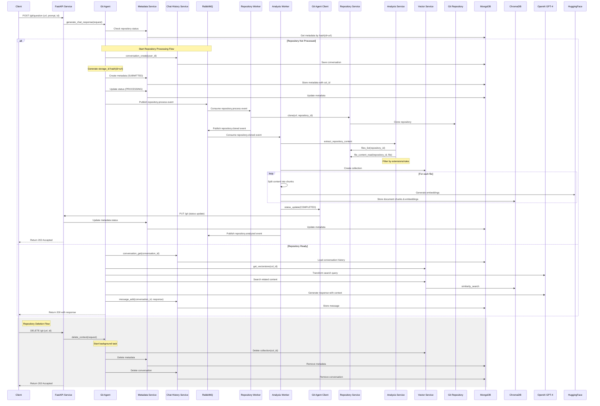

# Agents

A Kubernetes-based framework for building AI-powered agents with a reference implementation for Git repository analysis. The framework provides core components and abstractions for developing specialized agents that can leverage language models, vector storage, and persistent data management. The included Git analysis service demonstrates these capabilities by enabling natural language interactions with code repositories.
## Overview

The Agents framework consists of:

### Core Framework
- Base agent interfaces and implementations
- Event-driven messaging infrastructure
- Common persistence interfaces
- Standardized service patterns
- Environment configuration utilities

### Infrastructure Components
- MongoDB for persistent storage and metadata
- ChromaDB for vector embeddings and search
- RabbitMQ for event messaging and task queues

### Services Layer
- Vector processing service
- Chat history management
- Repository analysis service
- Metadata management service

### Reference Implementation
The Git Agent serves as a complete reference implementation demonstrating the framework's capabilities.

The Agents system is designed to:
- Clone and analyze Git repositories
- Generate vector embeddings of repository content
- Store repository metadata and chat history
- Enable natural language interactions with codebases
- Scale horizontally in Kubernetes environments

Key Features:
- RESTful API interface
- Persistent vector storage using ChromaDB
- Metadata and chat history storage using MongoDB
- Kubernetes-native deployment
- Horizontal pod autoscaling
- Configurable resource management
- Support for multiple concurrent repository analyses

## System Architecture

### Core Components
1. **Base Framework (`/core`)**
   - Framework contracts (DTOs, interfaces, errors)
   - Infrastructure layer (MongoDB, ChromaDB, RabbitMQ)
   - Common services (vector operations, chat history)
   - Configuration management
   - Error handling middleware

2. **Git Agent (`/git`)**
   - API layer (FastAPI endpoints)
   - Background workers
   - Business services
   - Domain models
   - Event handlers

3. **Infrastructure Services**
   - ChromaDB (vector storage)
   - MongoDB (metadata and chat history)
   - RabbitMQ (message queue)
   - Kubernetes deployment

The system consists of several key components deployed in a Kubernetes cluster:



Core Components:
- FastAPI Service: Handles HTTP requests and manages background tasks
- Git Agent: Processes repositories and manages interactions with AI models
- ChromaDB: Vector store for semantic search capabilities
- MongoDB: Persistent storage for metadata and chat history
- OpenAI GPT-4: Large language model for natural language understanding

## Component Flow




### Data Flow

```mermaid
flowchart LR
    %% Repository Processing Flow
    subgraph Input[Repository Ingestion]
        RepoURL[Git Repository URL] --> Validate[Validate URL]
        Validate --> ProcessEvent[Repository Process Event]
        ProcessEvent --> Clone[Clone Repository]
        Clone --> CloneEvent[Repository Cloned Event]
        CloneEvent --> Extract[Extract Content]
        Extract --> FilterContent[Filter Content]
        FilterContent --> Chunks[Generate Chunks]
        Chunks --> SaveMetadata[Store Initial Metadata]
    end

    subgraph Analysis[Content Processing]
        Chunks --> GenEmbeddings[Generate Embeddings]
        GenEmbeddings --> StoreVectors[Store Vector Data]
        StoreVectors --> IndexVectors[Index Vectors]
        IndexVectors --> AnalyzedEvent[Repository Analyzed Event]
        AnalyzedEvent --> StatusUpdate[Git Agent Client Status Update]
        StatusUpdate --> APIUpdate[API Status Update]
        APIUpdate --> UpdateStatus[Update Processing Status]
        UpdateStatus --> Notify[Notify Completion]
    end
    
    subgraph Query[Chat Processing]
        Question[User Question] --> ValidateQuery[Validate Query]
        ValidateQuery --> CheckStatus[Check Repository Status]
        CheckStatus --> |If Ready| LoadHistory[Load Chat History]
        CheckStatus --> |Not Ready| ReturnStatus[Return Processing Status]
        LoadHistory --> LoadContext[Load Relevant Context]
        LoadContext --> TransformQuery[Transform Query]
        TransformQuery --> SearchVectors[Search Vector Store]
        SearchVectors --> RankResults[Rank Results]
        RankResults --> BuildPrompt[Build LLM Prompt]
        BuildPrompt --> GenerateResponse[Generate Response]
        GenerateResponse --> ValidateResponse[Validate Response]
        ValidateResponse --> SaveHistory[Store Chat History]
    end

    subgraph Storage[Persistent Storage]
        GitStorage[(Local Git Storage)]
        ChromaDB[(ChromaDB Vector Store)]
        MongoDB[(MongoDB Document Store)]
    end

    subgraph Events[Event Processing]
        EventBus{RabbitMQ Event Bus}
        ProcessEvent --> EventBus
        CloneEvent --> EventBus
        AnalyzedEvent --> EventBus
        Notify --> EventBus
    end

    %% Connect flows to storage
    Clone --> GitStorage
    StoreVectors --> ChromaDB
    IndexVectors --> ChromaDB
    SaveMetadata --> MongoDB
    UpdateStatus --> MongoDB
    SearchVectors --> ChromaDB
    SaveHistory --> MongoDB
    LoadHistory --> MongoDB
    LoadContext --> ChromaDB

    %% Error flows
    Validate --> |Invalid| ErrorHandler[Error Handler]
    Clone --> |Failed| ErrorHandler
    Extract --> |Failed| ErrorHandler
    GenEmbeddings --> |Failed| ErrorHandler
    ValidateQuery --> |Invalid| ErrorHandler
    ValidateResponse --> |Invalid| ErrorHandler
    StatusUpdate --> |Failed| ErrorHandler

    %% Style Definitions
    classDef process fill:#f9f,stroke:#333,stroke-width:2px
    classDef storage fill:#bbf,stroke:#333,stroke-width:2px
    classDef event fill:#bfb,stroke:#333,stroke-width:2px
    classDef error fill:#fbb,stroke:#333,stroke-width:2px
    classDef validate fill:#ffb,stroke:#333,stroke-width:2px
    classDef update fill:#dfd,stroke:#333,stroke-width:2px

    class Clone,Extract,GenEmbeddings,BuildPrompt,GenerateResponse process
    class GitStorage,MongoDB,ChromaDB storage
    class ProcessEvent,CloneEvent,AnalyzedEvent,EventBus event
    class ErrorHandler error
    class Validate,ValidateQuery,ValidateResponse validate
    class StatusUpdate,APIUpdate update
```



## Setup and Installation

### Prerequisites
- Kubernetes cluster
- Helm v3+
- Python 3.12+
- OpenAI API key


### Environment Configuration
Copy `.env.example` to `.env` and configure:
```
OPENAI_API_KEY=<<OPENAI API KEY>>
HASH_KEY=<<PRESHARED HASHING KEY>>
```
 